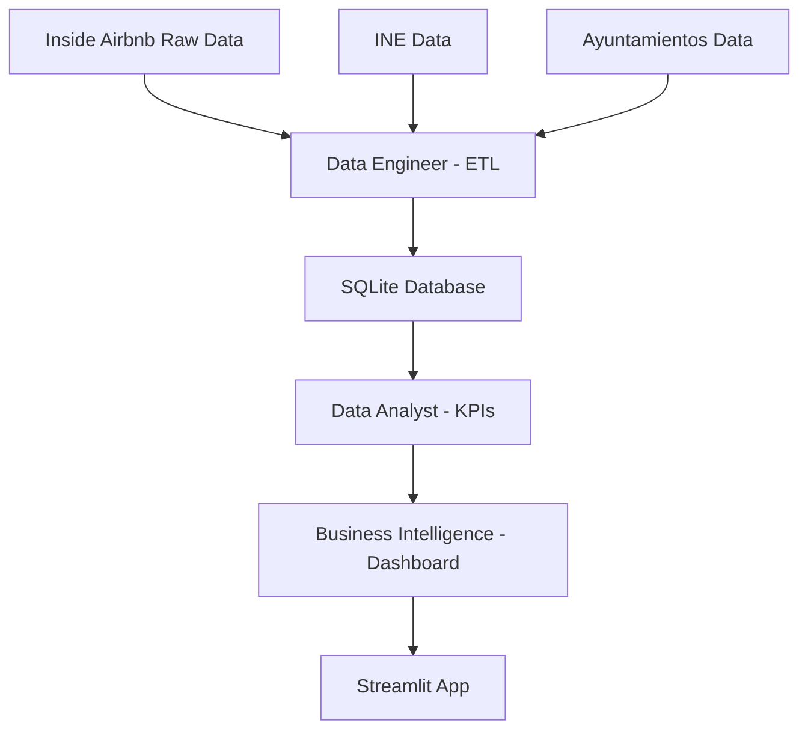

# 🛠️ **GUÍA TÉCNICA - CONSULTORES TURISMO SOSTENIBLE**

<div align="center">


## 📊 Documentación Técnica del Proyecto Inside Airbnb

</div>

---

## 🎯 **INTRODUCCIÓN**

Esta guía técnica describe la arquitectura, metodología y procesos de desarrollo del proyecto de análisis del impacto urbano de Airbnb desarrollado por el equipo de Consultores en Turismo Sostenible.

---

## 🏗️ **ARQUITECTURA DEL SISTEMA**

### 📊 **Flujo de Datos**



### 🔧 **Componentes Principales**

1. **Data Layer** 📊
   - Datos raw de Inside Airbnb
   - Fuentes oficiales (INE, Ayuntamientos)
   - Base de datos SQLite procesada

2. **Processing Layer** ⚙️
   - ETL pipelines (Persona A)
   - Análisis estadístico (Persona B)
   - Generación de KPIs

3. **Presentation Layer** 📱
   - Dashboard Streamlit
   - Visualizaciones interactivas
   - Sistema de alertas

---

## 💻 **REQUISITOS TÉCNICOS**

### 🐍 **Python y Dependencias**

```python
# Versión mínima de Python
python >= 3.9

# Dependencias principales
streamlit >= 1.29.0
pandas >= 2.0.0
plotly >= 5.17.0
folium >= 0.15.0
sqlite3 (incluido en Python)
numpy >= 1.24.0
```

### 📦 **Instalación del Entorno**

```bash
# 1. Crear entorno virtual
python -m venv venv

# 2. Activar entorno
# Windows:
venv\Scripts\activate
# Linux/Mac:
source venv/bin/activate

# 3. Instalar dependencias
pip install -r requirements.txt

# 4. Verificar instalación
python -c "import streamlit; print('✅ Streamlit instalado correctamente')"
```

---

## 📊 **ESTRUCTURA DE DATOS**

### 🗃️ **Base de Datos SQLite**

La base de datos `airbnb_consultores_turismo.db` contiene las siguientes tablas:

```sql
-- Tabla principal de listings
CREATE TABLE listings_unificado (
    id INTEGER PRIMARY KEY,
    ciudad TEXT,
    barrio TEXT,
    latitude REAL,
    longitude REAL,
    price REAL,
    room_type TEXT,
    minimum_nights INTEGER,
    availability_365 INTEGER
);

-- KPIs por ciudad
CREATE TABLE kpis_por_ciudad (
    ciudad TEXT PRIMARY KEY,
    total_listings INTEGER,
    ratio_entire_home_pct REAL,
    precio_medio_euros REAL,
    disponibilidad_promedio REAL
);

-- KPIs por barrio
CREATE TABLE kpis_por_barrio (
    barrio TEXT,
    ciudad TEXT,
    total_listings INTEGER,
    ratio_entire_home_pct REAL,
    precio_medio_euros REAL,
    capacidad_total INTEGER,
    PRIMARY KEY (barrio, ciudad)
);

-- KPIs de impacto urbano
CREATE TABLE kpis_impacto_urbano (
    ciudad TEXT,
    barrio TEXT,
    indice_saturacion REAL,
    impacto_vivienda REAL,
    densidad_turistica REAL,
    PRIMARY KEY (ciudad, barrio)
);
```

### 📁 **Estructura de Archivos**

```
data/
├── raw/                    # Datos originales (NO en Git)
│   ├── madrid/
│   │   ├── listings.csv
│   │   ├── calendar.csv
│   │   └── neighbourhoods.geojson
│   ├── barcelona/
│   └── mallorca/
├── processed/              # Datos procesados (SÍ en Git)
│   ├── airbnb_consultores_turismo.db
│   ├── kpis_por_barrio.csv
│   ├── neighbourhoods_madrid.geojson
│   └── datos_economicos_turismo.csv
└── external/               # Fuentes adicionales
```

---

## ⚙️ **PROCESOS ETL**

### 🔄 **Pipeline de Procesamiento**

#### **Fase 1: Extracción (Data Engineer)**

```python
def extraer_datos_airbnb(ciudad, ruta_raw):
    """
    Extrae datos raw de Inside Airbnb
    """
    listings = pd.read_csv(f"{ruta_raw}/{ciudad}/listings.csv")
    calendar = pd.read_csv(f"{ruta_raw}/{ciudad}/calendar.csv")
    neighbourhoods = gpd.read_file(f"{ruta_raw}/{ciudad}/neighbourhoods.geojson")
    
    return listings, calendar, neighbourhoods
```

#### **Fase 2: Transformación (Data Engineer)**

```python
def limpiar_datos_listings(df):
    """
    Limpia y normaliza datos de listings
    """
    # Limpiar precios
    df['price'] = df['price'].str.replace('[$,]', '', regex=True).astype(float)
    
    # Normalizar nombres de barrios
    df['neighbourhood_cleansed'] = df['neighbourhood_cleansed'].str.lower().str.strip()
    
    # Filtrar outliers
    df = df[df['price'].between(10, 1000)]
    
    return df
```

#### **Fase 3: Carga (Data Engineer)**

```python
def cargar_a_sqlite(dataframes, db_path):
    """
    Carga datos procesados a SQLite
    """
    conn = sqlite3.connect(db_path)
    
    for nombre, df in dataframes.items():
        df.to_sql(nombre, conn, if_exists='replace', index=False)
    
    conn.close()
```

---

## 📊 **METODOLOGÍA DE KPIS**

### 🔢 **Cálculo de Métricas Principales**

#### **1. Ratio Turístico/Residencial**

```python
def calcular_ratio_entire_home(df):
    """
    Calcula % de entire home/apt por barrio
    """
    total_por_barrio = df.groupby('neighbourhood_cleansed').size()
    entire_home_por_barrio = df[df['room_type'] == 'Entire home/apt'].groupby('neighbourhood_cleansed').size()
    
    ratio = (entire_home_por_barrio / total_por_barrio * 100).fillna(0)
    return ratio
```

#### **2. Densidad de Saturación**

```python
def calcular_densidad_saturacion(df_listings, df_poblacion):
    """
    Calcula listings por 1000 habitantes
    """
    listings_por_barrio = df_listings.groupby('neighbourhood_cleansed').size()
    
    densidad = (listings_por_barrio / df_poblacion['poblacion'] * 1000).fillna(0)
    return densidad
```

#### **3. Índice de Impacto Urbano**

```python
def calcular_impacto_urbano(ratio_entire, densidad, disponibilidad):
    """
    Índice compuesto de impacto urbano
    """
    # Normalizar valores 0-100
    ratio_norm = ratio_entire / 100
    densidad_norm = np.clip(densidad / 50, 0, 1)  # 50 listings/1000 hab = 100%
    disponibilidad_norm = disponibilidad / 365
    
    # Pesos: 40% ratio, 35% densidad, 25% disponibilidad
    impacto = (ratio_norm * 0.4 + densidad_norm * 0.35 + disponibilidad_norm * 0.25) * 100
    
    return impacto
```

---

## 🖥️ **DESARROLLO DEL DASHBOARD**

### 🎨 **Arquitectura Streamlit**

```python
# Estructura principal del dashboard
def main():
    # Configuración de página
    st.set_page_config(
        page_title="Dashboard Regulatorio Turismo Urbano",
        page_icon="🏛️",
        layout="wide"
    )
    
    # Cargar datos con cache
    df_listings, df_kpis_ciudad, df_kpis_barrio = cargar_datos()
    
    # Sidebar con controles
    with st.sidebar:
        ciudad_seleccionada = st.selectbox("Seleccionar Ciudad", opciones)
        
    # Tabs principales
    tab1, tab2, tab3 = st.tabs(["KPIs", "Mapas", "Alertas"])
```

### 📱 **Componentes Interactivos**

#### **Mapas Coropléticos**

```python
def crear_mapa_coropletico(df_kpis, geojson_data, ciudad):
    """
    Crea mapa interactivo con Plotly
    """
    fig = px.choropleth_mapbox(
        df_kpis,
        geojson=geojson_data,
        locations='barrio_norm',
        color='ratio_entire_home_pct',
        hover_data=['total_listings', 'precio_medio_euros'],
        mapbox_style="carto-darkmatter",
        zoom=10
    )
    
    return fig
```

#### **Sistema de Alertas**

```python
def generar_alertas(df_kpis):
    """
    Sistema automático de alertas por saturación
    """
    def clasificar_nivel(ratio):
        if ratio > 80: return "🔴 CRÍTICO"
        elif ratio > 60: return "🟠 ALTO"
        elif ratio > 40: return "🟡 MODERADO"
        else: return "🟢 SOSTENIBLE"
    
    df_kpis['nivel_alerta'] = df_kpis['ratio_entire_home_pct'].apply(clasificar_nivel)
    return df_kpis
```

---

## 🔧 **CONFIGURACIÓN Y DESPLIEGUE**

### 🌐 **Despliegue en Streamlit Cloud**

1. **Preparación del repositorio:**
   ```bash
   # Verificar estructura
   ls -la
   # Debe contener: app.py, requirements.txt, data/processed/
   ```

2. **Configuración secrets.toml:**
   ```toml
   # .streamlit/secrets.toml
   [database]
   path = "data/processed/airbnb_consultores_turismo.db"
   ```

3. **Variables de entorno:**
   ```bash
   export STREAMLIT_SERVER_PORT=8501
   export STREAMLIT_SERVER_ADDRESS=0.0.0.0
   ```

### 🔒 **Seguridad y Permisos**

- ✅ Datos sensibles en `.gitignore`
- ✅ Secrets en configuración segura
- ✅ Validación de inputs de usuario
- ✅ Rate limiting en carga de datos

---

## 🧪 **TESTING Y VALIDACIÓN**

### ✅ **Tests de Calidad de Datos**

```python
def test_calidad_datos(df):
    """
    Valida calidad de los datos procesados
    """
    # Test 1: No hay valores nulos en columnas críticas
    assert not df[['ciudad', 'barrio', 'price']].isnull().any().any()
    
    # Test 2: Precios en rango lógico
    assert df['price'].between(10, 1000).all()
    
    # Test 3: Coordenadas válidas
    assert df['latitude'].between(-90, 90).all()
    assert df['longitude'].between(-180, 180).all()
    
    print("✅ Todos los tests de calidad pasaron")
```

### 📊 **Validación de KPIs**

```python
def validar_kpis(df_kpis):
    """
    Valida coherencia de KPIs calculados
    """
    # Ratios entre 0-100%
    assert df_kpis['ratio_entire_home_pct'].between(0, 100).all()
    
    # Precios > 0
    assert (df_kpis['precio_medio_euros'] > 0).all()
    
    # Total listings coherente
    assert (df_kpis['total_listings'] > 0).all()
    
    print("✅ KPIs validados correctamente")
```

---

## 📈 **MONITOREO Y MANTENIMIENTO**

### 🔄 **Actualización de Datos**

```python
def actualizar_datos_periodico():
    """
    Script para actualización automática de datos
    """
    # 1. Descargar nuevos datos de Inside Airbnb
    # 2. Ejecutar pipeline ETL
    # 3. Recalcular KPIs
    # 4. Actualizar base de datos
    # 5. Notificar cambios significativos
```

### 📊 **Métricas de Rendimiento**

- ⚡ Tiempo de carga del dashboard: < 3 segundos
- 📊 Tiempo de procesamiento ETL: < 5 minutos
- 💾 Tamaño de base de datos: < 50MB
- 🔄 Frecuencia de actualización: Mensual

---

## 🆘 **TROUBLESHOOTING**

### ❌ **Problemas Comunes**

1. **Error de conexión a base de datos:**
   ```python
   # Verificar ruta de BD
   import os
   print(os.path.exists("data/processed/airbnb_consultores_turismo.db"))
   ```

2. **Mapas no se visualizan:**
   ```python
   # Verificar archivos GeoJSON
   import json
   with open("data/processed/neighbourhoods_madrid.geojson") as f:
       geojson = json.load(f)
   print(f"Features encontradas: {len(geojson['features'])}")
   ```

3. **Streamlit no inicia:**
   ```bash
   # Reinstalar dependencias
   pip install --upgrade streamlit
   streamlit hello  # Test básico
   ```

---

## 📚 **RECURSOS ADICIONALES**

### 🔗 **Enlaces Útiles**
- [Documentación Streamlit](https://docs.streamlit.io/)
- [Plotly Python](https://plotly.com/python/)
- [Inside Airbnb Data](http://insideairbnb.com/get-the-data.html)
- [Pandas Documentation](https://pandas.pydata.org/docs/)

### 📧 **Soporte Técnico**
- **Email:** tech-support@consultores-turismo.es
- **Documentación:** `/docs/`
- **Issues:** GitHub Issues del proyecto

---

<div align="center">

### 🎯 **PROYECTO DESARROLLADO CON ESTÁNDARES PROFESIONALES**

*Consultores en Turismo Sostenible • Junio 2025*

</div>
